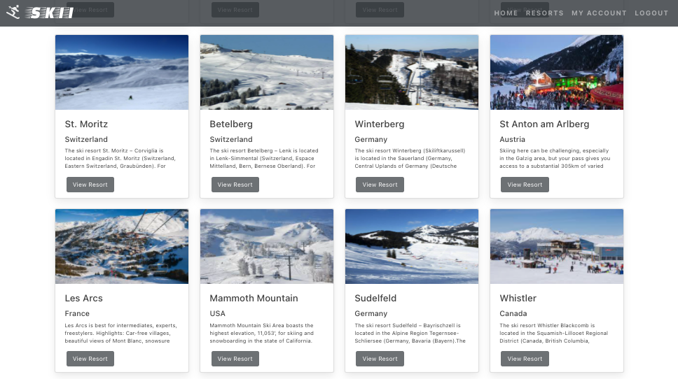
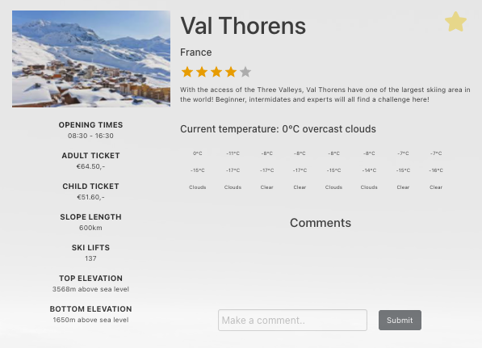
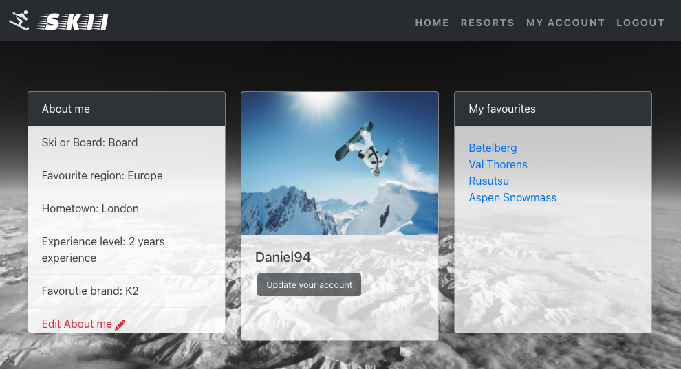
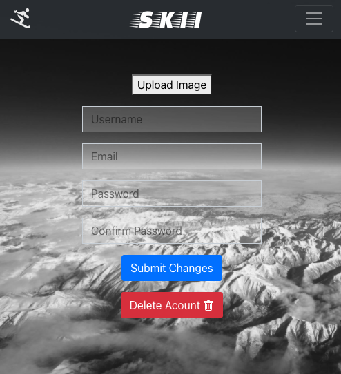

# Skii App (SEI Project 3)


### Table of Contents

- Project Overview
- The Brief
- Technologies Used
- The Approach
  - Back-end
  - Front-end
- Triumphs
- Obstacles Faced (and lessons!!)
- Future Features


<br>

## Project Overview

Skii is a global ski resort application that allows members to be part of an interactive, online community where information, thoughts and opinions on the major ski resorts across the world are shared. 

This week-long project expanded on my frontend React skills developed for my [Crypto-Index](https://github.com/DanielTockan/Crypto-Index) project, but with an integrated backend using MongoDB and Mongoose as the base technologies. Given that this was a larger group project consisting of 4 people, Git and GitHub were the collaboration and version control tools used for all work. 

I contributed to all aspects of the front-end and back-end but had my own areas of focus - these will be highlighted. Many external libraries were used to enhance the user experience on the client-side throughout the apps components. I implemented the Cloudinary widget library for image uploads for registered users with added crop functionality. Upon completion of the development phase of the project, it was deployed using Heroku.

### Click here to [Skii](https://lets-skii.herokuapp.com/) with us

To enjoy the full experience, you can register using the credentials of your choice or alternatively use the following:

email: admin@admin.com <br>
password: admin

<br>

## The Brief

- Build a full-stack MERN web application
- Use an Express API to serve your data from a Mongo database
- Consume your API with a separate front-end built with React
- Be a complete product which means multiple relationships and CRUD functionality for the relevant models
- Implement thoughtful user stories/wireframes, significant enough to clearly determine which features are core MVP and which are stretch goals
- Be deployed online so its accessible publicly (using Heroku and MongoDB Atlas database)
- Have a visually impressive design
- Timeframe: 1 week

<br>
<!-- - Use a framework for responsiveness.
- Stick with KISS (Keep It Simple Stupid) and DRY (Don't Repeat Yourself) principles.
- Use best practices for writing code, such as semantic markup. -->

## Technologies Used

### Back-end:

- Node.js
- Express
- MongoDB
- Mongoose
- Bcrypt
- JSON Web Token
- Body Parser

### Front-end:

- HTML
- CSS
- Bootstrap framework
- JavaScript
- React (with hooks)
- Axios
- Cloudinary
- React Mapbox GL
- External Weather API

### Development Tools:

- VS Code
- Git
- GitHub
- NPM
- Insomnia
- Chrome Dev Tools
- Heroku

<br>

## The Approach

Once the Ski resort concept was established a lot of focus was put into the planning of:
- What the models look like, and the relationships between them
- What controllers and routes were required
- Where the data would be retrieved from (external API's, manually creating it, or some combination etc.)
- What pages were needed on the frontend, and how they would interact with the API
- What the stretch goals for the project were, and thinking ahead particularly about how the models would be impacted to support those
- What external libraries would be implemented
- Wireframing and decisions on the layout and design of the app were tackled after the back-end was complete

The thorough approach taken towards planning was vital in ensuring that all group members understood how the app would function at a fundamental level. It provided transparency of the deliverables that needed to be complete, giving a baseline to track progress against. Most importantly, it made writing our code much simpler as less retrospective changes were necessary.


I took charge of the project management aspects for Skii. We used a Kanban style agile framework to monitor and control our work and progress with the help of a Trello board, and created user stories to define MVP and our stretch goals. 

INSERT  TRELLO SCREENSHOTS HERE
INSERT  TRELLO SCREENSHOTS HERE
INSERT  TRELLO SCREENSHOTS HERE
INSERT  TRELLO SCREENSHOTS HERE
INSERT  USER STORIES HERE!!!!!!
INSERT  USER STORIES HERE!!!!!!
INSERT  USER STORIES HERE!!!!!!

Daily stand-ups were held each morning, supplemented by regular check-ups on progress and any blockers faced. The occured via Zoom breakout rooms and Slack - this was particularly useful as we applied pair-programming for debugging and problem solving.

### Back-end:

#### Schemata

The first step taken was to create the schemata for the app. Based off of the initial planning, three were created:
 - Users schema
 - Resorts schema
 - Comments schema

```js
const resortsSchema = new mongoose.Schema({
  name: { type: String, required: true },
  country: { type: String, required: true },
  top_elevation: { type: Number, required: true },
  bottom_elevation: { type: Number, required: true },
  lon: { type: Number, required: true },
  lat: { type: Number, required: true },
  image: { type: String, required: true },
  comments: [commentSchema],
  description: { type: String },
  skilifts: { type: String },
  openingtimes: { type: String },
  slopeslength: { type: String },
  adultticket: { type: String },
  childticket: { type: String },
  user: { type: mongoose.Schema.ObjectId, ref: 'User', required: true },
  userRating: { type: Number, required: true },
  numOfRatings: { type: Number, required: true }
})
```

The resorts schema had two fields that required different types of relationships in order to get our desired functionality. 

A relationship was created between the user field and the model, with object level permissions in mind. For particular scenarios within the app, logic was created to ensure that only authorised users would be able to execute CRUD functions - this will be expanded on in the controllers section. A reference relationship was chosen in this instance as the asscociated user (super admins) needed to be able to associated to multiple resort in order to execute CRUD funcitons to them. 

Conversely, the comments field applied an embedded relationship with the resorts model. Comments made had to belong to ONLY one resort in order for users to have meaningful interactions about the resorts they loved in one location (the page for that resort) - a key aspect of the app, and the reason behind this choice. This consideration about user interaction was the driving factor for creating a comments schema, rather than just a comments field. Comments need to belong to a user to enhance the social aspect, and users needed to be able to make as many comments as they like. Both apects are not possible through using a comments field.

```js
const commentSchema = new mongoose.Schema({

  text: { type: String, required: true },
  user: { type: mongoose.Schema.ObjectId, ref: 'User', required: true }

}, {
  timestamps: true
})
```

For the user schema, we imported and employed the use of the Bcrypt library to hash and encrypt the users password as an added level of security. 

```js
  .pre('save', function hashPassword(next) {
    if (this.isModified('password')) {
      this.password = bcrypt.hashSync(this.password, bcrypt.genSaltSync())
    }
    next()
  })
```

Our password confirmation is stored in a virtual field and is checked against the password that the user enters before validation occurs.

```js
schema
  .virtual('passwordConfirmation')
  .set(function setPasswordConfirmation(passwordConfirmation) {
    this._passwordConfirmation = passwordConfirmation
  })
```

#### Controllers

CRUD methods were created for users and resorts to execute the app's functionality. I created the user controllers. 

Conditional logic was used for scenarios where only authorised users, or the user associated with a particular aspect of the app would be able to access or amend data. An instance of this can be seen with the "modifyUser" function, responsible for allowing users to edit their credentials.

```js
function modifyUser(req, res) {
  const accountId = req.params
  const finalId = accountId.accountId
  const body = req.body

  const currentUser = req.currentUser

  User
    .findById(finalId)
    .then(account => {
      if (!account) return res.send({ message: 'No user by this name' })
      if (!account._id.equals(currentUser._id)) {
        return res.status(401).send({ message: 'Unauthorised' })
      }
      account.set(body)
      console.log(body)

      return account.save()
    })
    .then(account => res.send(account))
    .catch(error => res.send(error))
}
```

All database requests to modify user credentials passed through the backe-end router via a PUT request. Secure route middleware was added to the route as follows:

```js
router.route('/users/:accountId')
  .get(userController.singleUser)
  .delete(secureRoute, userController.removeUser)
  .put(secureRoute, userController.modifyUser)
```

The secure route controlled the authentication process, storing the ID of the logged in user via a Bearer token. JSON Web Token technology was imported to enable this like so:

```js
function secureRoute(req, res, next) {
  const authToken = req.headers.authorization
  console.log('in the secure route')
  console.log(authToken)

  if (!authToken || !authToken.startsWith('Bearer')) {
    console.log('first check')
    return res.status(401).send({ message: 'Unauthorised 1 - update and imageupload' })
  }
  const token = authToken.replace('Bearer ', '')

  jwt.verify(token, secret, (err, payload) => {
    if (err) return res.status(401).send({ message: 'Unauthorised 2' })
    console.log('second check')

    const userId = payload.sub
    User
      .findById(userId)
      .then(user => {
        if (!user) return res.status(401).send({ message: 'Unauthorised 3' })
        console.log('third check')

        req.currentUser = user

        next()
      })
      .catch(()=> res.status(401).send({ message: 'Unauthorised 4' }))
  })
}
```

The two "if" statements within "modifyUser" function, then conducted the following checks: 
- The latter checked whether the user ID retrieved from the secure route matches that of the user that they are trying to edit. If not, access to the route was blocked
- The former checked whether a valid user is logged in to begin with. If not, once again, access to the route was blocked

The secure route was used across many other routes in our back-end for the following uses:
- Creating, updating and deleting comments
- Adding and removing favourite resorts to a user profile

Before proceeding to the front-end build, all controllers were tested on the back-end using Insomnia. This was a paired exercise carried out by Kasjan and myself.

Making reference to the "modifyUser" function once again, the following test was carried out to ensure that the user level permissions worked as expected.


### Front-end:

After installing the React app and all the relevent depedencies, final sign-off was given on the pages that would be included. These were:
- Home Page
- Resorts Page
- Individual Resort Page
- My Account Page
- Login and Sign Up Page

A combination of the Bootstrap framework and CSS were used for styling, with a monochromatic colour scheme to match the ice white snow theme.

#### Home Page

As the first point of contact with the App, I wanted something visually impressive that drew users in.


Using the React MapBox GL library, we rendered a map of the world, with markers depciting the resorts seeded from our database. The longitude and latitude fields present in our resorts model enabled this. React Links were used to send the user to the resort page of marker they clicked on.

```js
{resorts.map((resort, index) => {
        return <Link to={`/resorts/${resort.name}`} key={index}>
          <Marker 
            latitude={resort.lat}
            longitude={resort.lon}
            
          >
            {/* <div>
              <span>{resort.name}</span>
            </div> */}

            
          </Marker>
        </Link>
      })}
```

A function enabling users to filter for the regions they are most interesting was applied, by clicking on the buttons towards the top left.

```js
function goToEurope() {
    const WorldViewport = {
      latitude: 46.2276,
      longitude: 2.2137,
      zoom: 4,
      height: '100vh',
      width: '100vw'
    }
    setViewPort(WorldViewport)
  }
```

#### Resorts & Single Resort Page

For an alternate view to see all the resorts in our database, the resorts button in our navigation bar leads the user to this page:



The display was achieved by mapping the resorts from our database into cards on a page, like so:

```js
{resorts.map((resort, index) => {

        return <div key={index} className="card">
          </img>
          <div className="card-body">
            <h5 className="card-title">{resort.name}</h5>
            <h6>{resort.country}</h6>
            <p className="card-text-all-resorts">{resort.description}</p>
            {/* <p className="dot-dot">...</p> */}

            <Link to={`/resorts/${resort.name}`} className="btn btn-dark btn-resort">View Resort</Link>
          </div>
        </div>

      })}
```

Clicking on any of these resorts linked you to the individual page for the resort.

Here, users are also able to:
  - View information specific to that resort
  - Add the resort to their favourites (displayed on My Account page)
  - Leave comments about the resort (with CRUD fucntionality and user level permissions applied)
  - Add a rating to the resort



- An external weather API and useState were used to obtain and dynamically update the current weather, and forecasts for the next 7 days:
- Similarly to the markers on the homepage, weather information was obtained using longitude and latitude co-ordinates

```js
const [weather, updateWeather] = useState({ current: { weather: [{}] }, daily: [] })
```

```js
Resorts.
    findOne({ name: { $regex: name, $options: 'i' } } )
    .populate('comments.user')
    .then(resort => {
      axios.get(`https://api.openweathermap.org/data/2.5/onecall?lat=${resort.lat}&lon=${resort.lon}&exclude=hourly,minutely&appid=b12529b2552a67b6714b256d3318424c`)
        .then(resp => {


          res.send({ resort: resort, weather: resp.data })
        })
```

#### My Account Page

The My Account page is the one stop shop for editing personal information, uploading a new display picture and viewing your favourite resorts.



The most complex aspect of this page was the integration of the cloudinary widget to faciliatate the upload of new images. This was implemented fully in the update your account page: 



This library was outside of the scope of the course, requiring me to go through the the source documentation. I produced the following function that was triggered by an onClick event listener whenever the upload image button was pressed:

```js
function handleImageUpload(event) {
    event.preventDefault()

    const token = localStorage.getItem('token')

    window.cloudinary.createUploadWidget(
      {
        cloudName: 'dzt94',
        uploadPreset: 'skiresortapp',
        cropping: true
      },
      (err, result) => {
        if (result.event !== 'success') {
          return
        }
        axios.put(`/api/users/${props.match.params.id}`, { image: result.info.secure_url }, {
          headers: { Authorization: `Bearer ${token}` }
        })
          .then((res) => updateFormData(res.data))
      }
    ).open()
  }
```