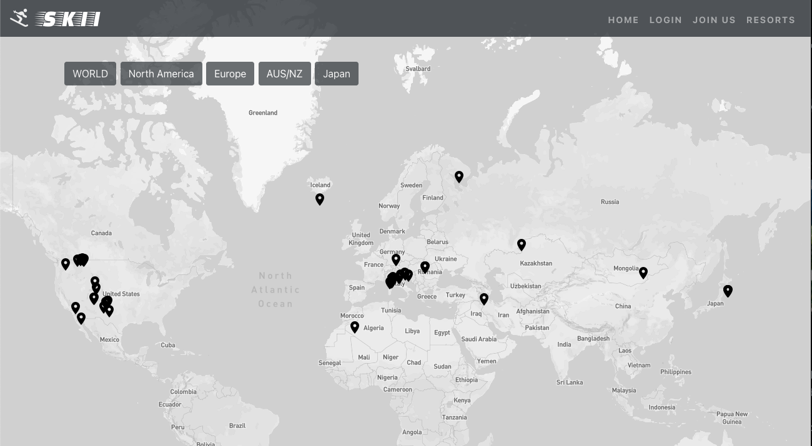
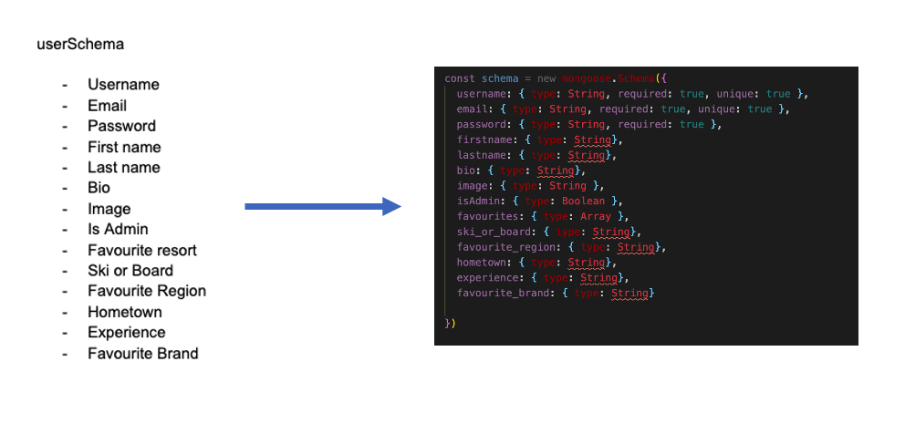
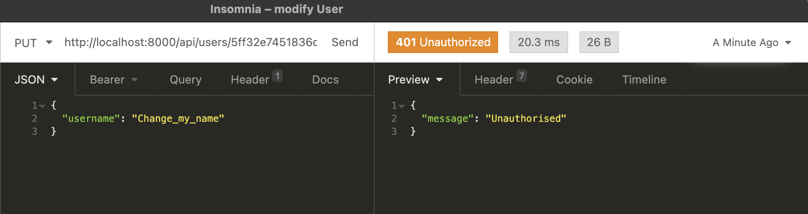

# Skii App (SEI Project 3)



<br>

### Table of contents

- Project Overview
- The Brief
- Technologies Used
- Approach Taken
  - Back-end
  - Front-end
- Final Product
- Wins & Blockers
- Bugs
- Future Features
- Key Learnings

<br>

## Overview

Skii is a global ski resort application that allows members to be part of an interactive, online community where information, thoughts and opinions on the major ski resorts across the world are shared. This week-long project expanded on my frontend React skills developed for my [Crypto-Index](https://github.com/DanielTockan/Crypto-Index) project, but with an integrated backend using MongoDB and Mongoose as the base technologies. 

Given that this was a larger group project consisting of 4 people, Git and GitHub were the collaboration and version control tools used for all work. On the back-end, I contributed to all aspects but was heavily involved in the user level and object level authentication and middleware used for onbaording on logging in. I also  designed the router and user controllers.

Many external libraries were used to enhance the user experience on the client-side throughout the apps components. I implemented the Cloudinary widget library for image uploads for registered users with added crop functionality. Upon completion of the development phase of the project, it was deployed using Heroku.

### Click here to [Skii](https://lets-skii.herokuapp.com/) with us

To enjoy the full experience, you can register using the credentials of your choice or alternatively use the following:

email: admin@admin.com <br>
password: admin

<br>

## The Brief

- Build a full-stack MERN web application
- Use an Express API to serve your data from a Mongo database
- Consume your API with a separate front-end built with React
- Be a complete product which means multiple relationships and CRUD functionality for the relevent models
- Implement thoughtful user stories/wireframes, significant enough to clearly determine which features are core MVP and which are stretch goals
- Be deployed online so its accessible publicly (using Heroku and MongoDB Atlas database)
- Have a visually impressive design
- Timeframe: 1 week

<br>
<!-- - Use a framework for responsiveness.
- Stick with KISS (Keep It Simple Stupid) and DRY (Don't Repeat Yourself) principles.
- Use best practices for writing code, such as semantic markup. -->

## Technologies Used

### Back-end:

- Node.js
- Express
- MongoDB
- Mongoose
- Bcrypt
- JSON Web Token
- Body Parser

### Front-end:

- HTML
- CSS
- Bootstrap framework
- JavaScript
- React
- Axios
- Cloudinary
- React Mapbox GL
- External Weather API

### Development tools:

- VS Code
- Git
- GitHub
- NPM
- Insomnia
- Chrome Dev Tools
- Heroku

<br>

## Approach

Once the Ski resort concept was established a lot of focus was put into the planning of:
- What the models look like, and the relationships between them
- What controllers and routes were required
- Where the data would be retrieved from (external API's, manually creating it, or some combination etc.)
- What pages were needed on the frontend, and how they would interact with the API
- What the stretch goals for the project were, and thinking ahead particularly about how the models would be impacted to support those
- What external libraries would be implemented
- Wireframing and decisions on the layout and design of the app were tackled after the back-end was complete

The thorough approach takrn towards planning was vital in ensuring that all group members understood how the app would function at a fundamental level. It provided transparency to the deliverables that needed to be complete, giving us a baseline to track progress against. Most importantly, it made writing our code much simpler as less retrospective changes were necessary.



I took charge of the project management aspects for Skii. We used an agile framework to monitor and control our work and progress, specifically Kanban, with the help of a Trello board. 

INSERT  TREllO SCREENSHOTS HERE

Daily stnad-ups were held every monring, as well as regular check-ups on any blockers or progress anybody had faced. We were in constant communication via Zoom breakout rooms and Slack - this was particularly useful as we applied pair-programming for debugging and problem solving.

### Back-end:

The first step taken was to create the schemata for the app. Based off of the notes from the plan created initially, we created three - one for the resorts, users and comments.

#### Schemata

```js
const resortsSchema = new mongoose.Schema({
  name: { type: String, required: true },
  country: { type: String, required: true },
  top_elevation: { type: Number, required: true },
  bottom_elevation: { type: Number, required: true },
  lon: { type: Number, required: true },
  lat: { type: Number, required: true },
  image: { type: String, required: true },
  comments: [commentSchema],
  description: { type: String },
  skilifts: { type: String },
  openingtimes: { type: String },
  slopeslength: { type: String },
  adultticket: { type: String },
  childticket: { type: String },
  user: { type: mongoose.Schema.ObjectId, ref: 'User', required: true },
  userRating: { type: Number, required: true },
  numOfRatings: { type: Number, required: true }
})
```

As can be seen above, the resorts schema had two fields that required different types of relationships in order to get our desired functionality. 

The user field relationship was formed with USER LEVEL/OBJECT LEVEL(WHICH ONE??) permissions in mind. As you will see in the controller section, logic was created to ensure that only the creator/poster of the resort (in this case the super admin) would be able to delete or edit the resort details. A REFERENCE RELATIONSHIP WAS USED FOR THIS FIELD BECAUSE... (STATE THE LOGIC AND REASONING BEHIND THIS).

The comments field relationship existed as we wanted users to talk and interact about their favourite resorts. AN EMBEDDED RELATIONSHIP WAS CHOSEN BECAUSE....... (STATE THE LOGIC AND REASONING BEHIND THIS). The comment schema had a user reference relationship of its own in order to assign a user to the comment they made. This was the reason for creating a schema for comments, rather than having a comment field within the resorts schema.

```js
const commentSchema = new mongoose.Schema({

  text: { type: String, required: true },
  user: { type: mongoose.Schema.ObjectId, ref: 'User', required: true }

}, {
  timestamps: true
})
```

For the user schema, we employed the use of the Bcrypt library to hash the users password as an added level of security. Our password confirmation is stored in a virtual field and is checked against tge password the user enters before validation.

The planning phase of the project enabled me to determine the correct relationship types from the offset meaning that no retrospective changes were necessary.


#### Controllers

CRUD methods were created for both the users and resorts to execute the app's functionality. I created the user controllers. 

Considerations were made for scenarios where only logged in users, or the user assosciated with a particular aspect of the app should be able to access or amend data. An instance of this can be seen with the "modifyUser" function, responsible for allowing users to edit their credentials.

```js
function modifyUser(req, res) {
  const accountId = req.params
  const finalId = accountId.accountId
  const body = req.body

  const currentUser = req.currentUser

  User
    .findById(finalId)
    .then(account => {
      if (!account) return res.send({ message: 'No user by this name' })
      if (!account._id.equals(currentUser._id)) {
        return res.status(401).send({ message: 'Unauthorised' })
      }
      account.set(body)
      console.log(body)

      return account.save()
    })
    .then(account => res.send(account))
    .catch(error => res.send(error))
}
```

All requests made to the database to update user credential passed through the router in the back-end. Secure route middleware was added to the route as follows:

```js
router.route('/users/:accountId')
  .get(userController.singleUser)
  .delete(secureRoute, userController.removeUser)
  .put(secureRoute, userController.modifyUser)
```

The secure route controlled the authentication process, storing the ID of the logged in user via a Bearer token.

The two "if" statements within "modifyUser" function then conducted the following checks: 
- The latter checks whether the user ID retrieved from the secure route matches that of the user that they are trying to edit. If not, an authorisation message blocking the PUT request appears
- The former checks whether a valid user is logged in to begin with. If not, an authorisation message appears blocking access to the route 

The secure route was used across many other routes in our back-end for the following uses:
- Creating, updating and deleting comments
- Adding and removing favourite resorts to a user profiel

Before proceeding to the front-end build, all controllers were tested on the back-end using Insomnia. This was a paired excercise carried out by Kasjan and myself.

Making reference to the "modifyUser" function once again, the following test was carried out to ensure that the OBJECT/USER (WHICH ONE??) level permissions worked as expected.




### Front-end: