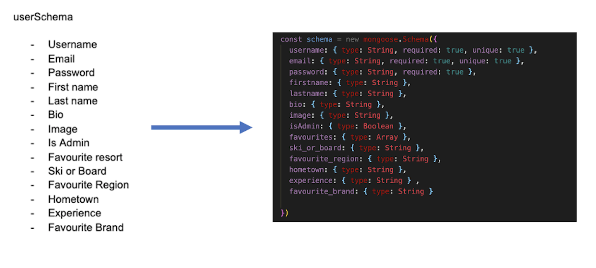

# Skii App (SEI Project 3)


### Table of contents

- Project Overview
- The Brief
- Technologies Used
- Approach Taken
  - Back-end
  - Front-end
- Final Product
- Wins & Blockers
- Bugs
- Future Features
- Key Learnings

## Overview

Skii is a global ski resort application that allows members to be part of an interactive, online community where information thoughts and opinions on the major ski resorts across the world are shared. This week-long project expanded on the frontend React skills developed for my [Crypto-Index](https://github.com/DanielTockan/Crypto-Index) project, but with an integrated backend using MongoDB and Mongoose. 

Given that this was a larger group project consisting of 4 people, Git and GitHub were the collaboration and version control tools used for all work. On the backend of the project, I contributed to all aspects but was heavily involved in the user level and object level authentication used for onbaording on logging in, as well as the design of the router and user controllers.

Many external libraries were used to enhance the user experience on the client-side throughout the application. I implemented the Cloudinary widget library for image uploads for registered users with added crop functionality. Upon completion of the development phase of the project, it was deployed using Heroku.

### Click here to [Skii](https://lets-skii.herokuapp.com/) with us

To enjoy the full experience of the application, you can register using the credentials of your choice or alternatively use the following:

email: admin@admin.com <br>
password: admin

## The Brief

- Build a full-stack MERN web application
- Use an Express API to serve your data from a Mongo database
- Consume your API with a separate front-end built with React
- Be a complete product which means multiple relationships and CRUD functionality for the relevent models
- Implement thoughtful user stories/wireframes, significant enough to clearly determine which features are core MVP and which are stretch goals
- Be deployed online so its accessible publicly (using Heroku and MongoDB Atlas database)
- Have a visually impressive design
- Timeframe: 8 days

<!-- - Use a framework for responsiveness.
- Stick with KISS (Keep It Simple Stupid) and DRY (Don't Repeat Yourself) principles.
- Use best practices for writing code, such as semantic markup. -->

## Technologies Used

### Back-end:

- Node.js
- Express
- MongoDB
- Mongoose
- Bcrypt
- JSON Web Token
- Body Parser

### Front-end:

- HTML
- CSS
- Bootstrap framework
- JavaScript
- React
- Axios
- Cloudinary
- React Mapbox GL
- External Weather API

### Development tools:

- VS Code
- Git
- GitHub
- NPM
- Insomnia
- Chrome Dev Tools
- Heroku


## Approach

Once the Ski resort concept for the project was established a lot of focus was put into the planning of
- What the models look like, and the relationships between them
- What controllers and routes were required
- Where the data would be retrieved from (external API's, manually creating it, or some combination etc.)
- What pages were needed on the frontend, and how they would interact with the API
- What the stretch goals for the project were, and thinking ahead particular about how the models would be impacted to support those
- What external libraries would be implemented

This thorough approach that we took to planning was vital in ensuring that all group members understood how the app would work at a fundamental level. It provided transparency to the deliverables that needed to be complete, giving us a baseline to track progress against. Most importantly, it made writing our code much simpler as less changes and amendments were needed necessary.



As a group, we opted to use an agile framework to monitor and control our work and progress. We used Kanban for this, with the help of a Trello board. Daily stnad-ups were held every monring, as well as regular check-ups on any blockers or progress anybody had faced. We were in constant communication via Zoom breakout rooms and Slack - this was particularly useful as we applied pair-programming for debugging and problem solving.

### Back-end:

The first step taken was to create the models for the app. It was determined that 3 models were necessary. Using Mongoose, they were created based off of the notes from the plan created initially.

#### Models

```js
const resortsSchema = new mongoose.Schema({
  name: { type: String, required: true },
  country: { type: String, required: true },
  top_elevation: { type: Number, required: true },
  bottom_elevation: { type: Number, required: true },
  lon: { type: Number, required: true },
  lat: { type: Number, required: true },
  image: { type: String, required: true },
  comments: [commentSchema],
  description: { type: String },
  skilifts: { type: String },
  openingtimes: { type: String },
  slopeslength: { type: String },
  adultticket: { type: String },
  childticket: { type: String },
  user: { type: mongoose.Schema.ObjectId, ref: 'User', required: true },
  userRating: { type: Number, required: true },
  numOfRatings: { type: Number, required: true }
})
```

As can be seen above, the resorts model had two fields that required different types of relationships in order to get our desired functionality. The user field relationship was formed with USER LEVEL/OBJECT LEVEL(WHICH ONE??) permissions in mind. As you will see in the controller section, logic was created to ensure that only the creator/poster of the resort (in this case the super admin) would be able to delete or edit the resort details. A REFERENCE RELATIONSHIP WAS USED FOR THIS FIELD BECAUSE... (STATE THE LOGIC AND REASONING BEHIND THIS)

<br>

The comments field relationship existed as we wanted users to talk and interact about their favourite resorts. AN EMBEDDED RELATIONSHIP WAS CHOSEN BECAUSE....... (STATE THE LOGIC AND REASONING BEHIND THIS). WHY DID THE COMMENTS HAD THEIR OWN SHCEMA, NOT JUST A NORMAL FIELD??. The comment model had a user reference relationship of its own in order to assign a user to the comment they made. Timestamp field was added also.

```js
const commentSchema = new mongoose.Schema({

  text: { type: String, required: true },
  user: { type: mongoose.Schema.ObjectId, ref: 'User', required: true }

}, {
  timestamps: true
})
```

The planning phase of the project enabled me to determine the correct relationship types from the offset meaning that no retrospective changes were necessary.

#### Controllers

CRUD methods were created for both the users and resorts to execute the app's functionality. I created the user controllers. 

<br>

Special considerations had to be made for scenarios where only logged in users, or the user assosciated with particular aspect of the app, be able to access or amend data. An instance of this can be seen with the "modifyUser" function, responsible for allowing users to edit their credentials.

```js
function modifyUser(req, res) {
  const accountId = req.params
  const finalId = accountId.accountId
  const body = req.body

  const currentUser = req.currentUser

  User
    .findById(finalId)
    .then(account => {
      if (!account) return res.send({ message: 'No user by this name' })
      if (!account._id.equals(currentUser._id)) {
        return res.status(401).send({ message: 'Unauthorised' })
      }
      account.set(body)
      console.log(body)

      return account.save()
    })
    .then(account => res.send(account))
    .catch(error => res.send(error))
}
```

The two "if" statements within the above function handled the USER/OBJECT (WHICH ONE??) level permission in this regard. 
- The former checks whether a valid user is logged in to begin with. If not, an error message appears blocking entry. 
- The latter checking whether the user ID asscosciated with the logged in user matches that of the user that they are trying to edit. If not, again, an error message blocking entry appears.

Before proceeding to the front-end build, all controllers were tested on the back-end using insomnia. This was a paired excercise carried out by myself and Kasjan.

<br>

Making reference to the "modifyUser" function once again, the following test was carried out to ensure the OBJECT/USER (WHICH ONE??) level permissions worked as expected.


#### Middleware


### Front-end:


We decided to construct a ski resorts website where the resorts were displayed using React native maps, and the user could check out information on each resort and interact with it such as add a star rating, post comments and add a resort to their favourites. Current weather conditions must be shown for each resort. An account section would let the user change the personal information and upload an avatar.

I was responsible for the front end user interface, the resorts page in the shape of cards, login and sign up page, singular resort page as well as all the backend endpoints and logic that match. However we worked together on many aspects of the project, growing our knowledge by sharing previous experience in different technologies.

For our React frontend, we implemented bootstrap as our css framework, giving us good efficiency when creating the interface.

## The resorts

After searching many ski API's, we couldn't find one to suit our needs and decided to create our own database with ski resort data taken from the web. The updating weather conditions are taken from an external open source weather API.


## Home Page

Using MapBox, the ski resorts from our API were seeded and displayed here as markers. Longtitude and lattitude are useful here as well as in the external weather API. The user can toggle different regions of the world with a simple nav bar.


- A function toggling North America

```js
  function goToNorthAmerica() {
    const NorthAmericaViewport = {
      latitude: 37,
      longitude: -102,
      zoom: 3,
      height: '100vh',
      width: '100vw'
    }
    setViewPort(NorthAmericaViewport)
  }
```
- Here the resorts are mapped into mapbox, a React Link is used to send the user to the desired resort on click.

```js
      {resorts.map((resort, index) => {
        return <Link to={`/resorts/${resort.name}`} key={index}>
          <Marker
            latitude={resort.lat}
            longitude={resort.lon}
          >
            
          </Marker>
        </Link>
      })}
    </MapGL>
```

## Resort Page

The singular resort page gives all the information about a given resort.


- Here the external weather API is used to .map the next 7 days of weather.

``` js
{weather.daily.map(day => {
                    return <div className="col" key={day.dt}><p>{(day.temp.max - 273) | 0}°C</p> <p>{(day.temp.min - 273) | 0}°C</p> <p>{day.weather[0].main}</p></div>
                  })}
```

- The comments section, a registered used can post a comment, and delete previous comments if they are the owner of the given comment.

``` js
{singleResort.comments && singleResort.comments.map(comment => {

                  return <div key={comment._id} className="row comments-spaced text-center">

                    <p className="comment-user">{comment.user.username}</p>
                    <p className="comment">{comment.text}</p>

                    {isCreator(comment.user._id) && <div>

                      <a className="trash-icon" onClick={() => handleDeleteComment(comment._id)}>{trash}</a>
                    </div>}

                  </div>

                })}
```


## Authentication

A middleware was working as a secure route to determine who the active user was and his/her permissions. It is used in the following scenarios:

- Editing a profile
- Removing a profile
- Creating a comment
- Deleting a comment
- Adding a resort to favourites
- Removing a resort from favourites

- Checking for a token:

```js
if (!authToken || !authToken.startsWith('Bearer')) {
    return res.status(401).send({ message: 'Unauthorised' })
  }
```

- A users token is verified as a second security step. Jwt.verify is used to match the user in the database. Potential errors are being listened for using .catch and returned accordingly.

```js
  jwt.verify(token, secret, (err, payload) => {
    if (err) return res.status(401).send({ message: 'Unauthorised' })

    const userId = payload.sub
    User
      .findById(userId)
      .then(user => {
        if (!user) return res.status(401).send({ message: 'Unauthorised' })

        req.currentUser = user

        next()
      })
      .catch(()=> res.status(401).send({ message: 'Unauthorised' }))
  })
```

Here is a a pre save function used to encrypt the users password upon registration and writing to the Users model.

```js
  .pre('save', function hashPassword(next) {
    if (this.isModified('password')) {
      this.password = bcrypt.hashSync(this.password, bcrypt.genSaltSync())
    }
    next()
  })
```

- The user model:

```js
const schema = new mongoose.Schema({
  username: { type: String, required: true, unique: true },
  email: { type: String, required: true, unique: true },
  password: { type: String, required: true },
  firstname: { type: String },
  lastname: { type: String },
  bio: { type: String },
  image: { type: String },
  isAdmin: { type: Boolean },
  favourites: { type: Array },
  ski_or_board: { type: String },
  favourite_region: { type: String },
  hometown: { type: String },
  experience: { type: String },
  favourite_brand: { type: String }
})
```

## My account

The ability to edit personal infromation, avatar and check out added favourites was implemented.


- Here is axios fetching our current user, to retrieve their information

```js
  useEffect(() => {
    axios.get(`/api/users/${props.match.params.id}`)
      .then((resp) => {
        updateFormData(resp.data)
        updateAccountData(resp.data)
        updateFavourites(resp.data.favourites)
      })
  }, [])
```

- A simple ul to show information:

```js
          <ul className="list-group list-group-flush card-transparent">
            <li className="list-group-item card-transparent">Ski or Board:  {formData.ski_or_board}</li>
            <li className="list-group-item card-transparent">Favourite region: {formData.favourite_region}</li>
            <li className="list-group-item card-transparent">Hometown:  {formData.hometown}</li>
            <li className="list-group-item card-transparent">Experience level:  {formData.experience}</li>
            <li className="list-group-item card-transparent">Favorutie brand:  {formData.favourite_brand}</li>
            <Link to={`/users/aboutme/${props.match.params.id}`}><li className="list-group-item text-danger card-transparent">Edit About me {pencilIcon}</li></Link>
          </ul>
```

- Mapping out the users favourites:

```js
            {formData && favourites.map((property, index) => {

              return <div key={index}>

                <Link to={`/resorts/${property}`}>{property}</Link>

              </div>

            })}
```

- A cloudinary widget implemented to allow the user to upload an avatar in the update acccount option

```js
    window.cloudinary.createUploadWidget(
      {
        cloudName: 'dzt94',
        uploadPreset: 'skiresortapp',
        cropping: true
      },
      (err, result) => {
        if (result.event !== 'success') {
          return
        }
        axios.put(`/api/users/${props.match.params.id}`, { image: result.info.secure_url }, {
          headers: { Authorization: `Bearer ${token}` }
        })
          .then((res) => updateFormData(res.data))
      }
    ).open()
  }
```

## Our API

The seed file we used to populate our API, with 40 resorts and a couple of test users. Here is an example.

```js 
{
mongoose.connect(
  dbURI,

  { useNewUrlParser: true, useUnifiedTopology: true, useCreateIndex: true },
  (err) => {

    if (err) return console.log(err)
    console.log('Mongoose connected!')

    mongoose.connection.db.dropDatabase()

      .then(() => {
        return User.create([
          {
            username: 'Admin',
            email: 'admin@admin.com',
            password: 'admin',
            passwordConfirmation: 'admin',
            image: 'https://i.imgur.com/4f1MbGO.png?1',
            isAdmin: true,
            favourites: [],
            ski_or_board: '',
            favourite_region: '',
            hometown: '',
            experience: '',
            favourite_brand: ''
          },
          
          ...
          
          
                .then((users) => {
        return Resorts.create([

          {
            name: 'Val Thorens',
            country: 'France',
            top_elevation: 3568,
            bottom_elevation: 1650,
            lon: 6.58000,
            lat: 45.29806,
            image: 'https://i.imgur.com/LumFgEX.jpg',
            user: users[0],
            description: 'With the access of the Three Valleys, Val Thorens have one of the largest skiing area in the world! Beginner, intermidates and experts will all find a challenge here!',
            skilifts: '137',
            openingtimes: '08:30 - 16:30',
            slopeslength: '600km',
            adultticket: '€64.50,-',
            childticket: '€51.60,-',
            userRating: 4,
            numOfRatings: 0
          },
```


## Bugs (Fixed)

- Fixed bootstrap card scaling when variable resort information length is given.
- Fixed image upload from cloudinary

 

## Potential future features

- Star and favourite option to show active status when page is refreshed/re-visited.
- Add a direct messaging inbox between users.
- Show active weather on the resort cards page.

## Artworks

Background

- pixabay.com
- imgur.com

Icons

- Font Awesome

## Contributors

- Kasjan Hinc
- Daniel Tockan
- Sean Fenelon
- Omar Alawi


### Front-end: